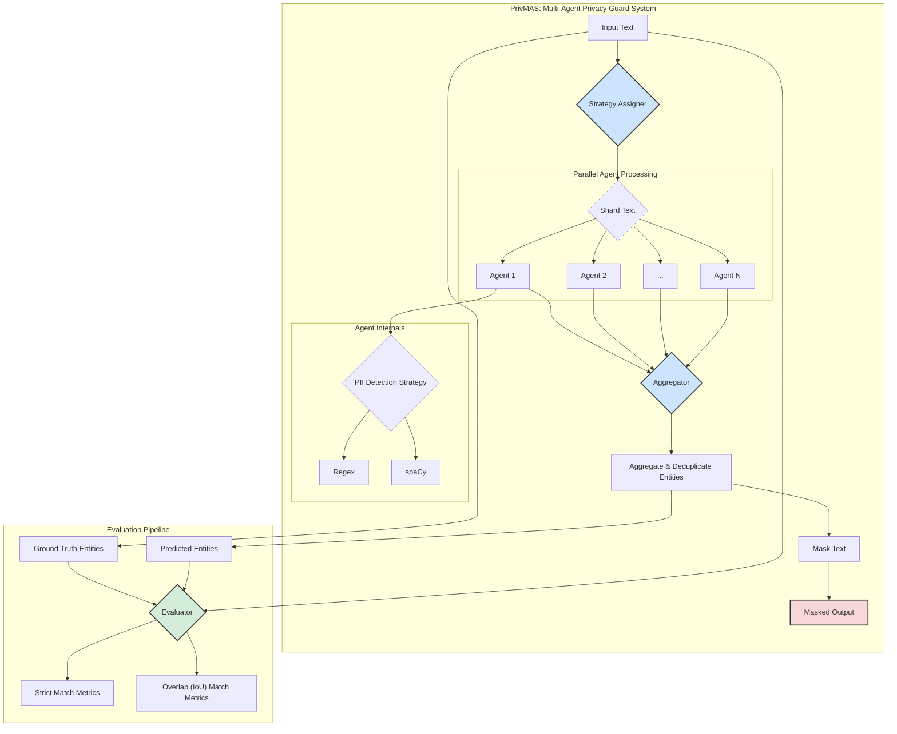

# **PrivMAS: A Scalable Multi-Agent System for High-Performance PII Detection and Masking**

## Abstract

The automated detection and redaction of Personally Identifiable Information (PII) is a critical task for safeguarding privacy in large-scale data processing pipelines. However, existing systems often face a trade-off between accuracy and computational performance. This project introduces the **Privacy-preserving Multi-Agent System (PrivMAS)**, a novel architecture designed to address this challenge. PrivMAS leverages a dynamic, parallelized multi-agent framework where autonomous agents concurrently process shards of text using a variety of PII detection strategies. We conduct a comprehensive analysis of the system's scalability, evaluating both performance and accuracy as the number of agents increases. Our findings reveal a near-linear scaling in processing latency but also expose a significant challenge: a degradation in accuracy (F1-score) as the system scales. This suggests complex underlying dynamics in entity aggregation and sharding that present critical avenues for future research in distributed PII detection systems.

---

## 1. Introduction

In an era of big data, the proliferation of sensitive information necessitates robust and efficient mechanisms for PII detection and masking. Traditional monolithic systems, while often accurate, can become bottlenecks when faced with high-throughput data streams. This research explores the hypothesis that a decentralized, multi-agent approach can offer superior performance and scalability.

### 1.1. Research Objectives

This study aims to:
1.  **Design and Implement PrivMAS:** Develop a scalable multi-agent system for parallel PII detection.
2.  **Analyze Performance Scaling:** Quantify how system latency and its constituent components evolve as the number of processing agents increases.
3.  **Evaluate Accuracy Scaling:** Measure the impact of parallelization on the accuracy of PII detection, using both strict and overlap-based matching criteria.
4.  **Identify System Bottlenecks:** Uncover the architectural and algorithmic factors that limit performance and accuracy in a distributed PII detection environment.

---

## 2. System Architecture

PrivMAS is designed as a modular pipeline that orchestrates multiple autonomous agents to perform PII detection in parallel.

**Architectural Components:**

1.  **Strategy Assigner:** A meta-agent that analyzes the input text and determines an optimal high-level strategy.
2.  **Text Sharding:** The input text is divided into multiple smaller, overlapping chunks (shards). This is a critical step to enable parallel processing.
3.  **Parallel Agent Processing:** A pool of `N` autonomous `GeneralistAgent` instances receives the shards. Each agent independently applies a PII detection strategy (e.g., Regex, spaCy) to its assigned shard.
4.  **Aggregator:** The results from all agents, which consist of detected PII entities, are collected by the Aggregator. This component is responsible for merging and deduplicating overlapping or redundant entity predictions from different agents to form a single, coherent set of entities.
5.  **Masking:** The final, aggregated list of PII entities is used to redact the original text, producing a privacy-safe output.

---

## 3. Experimental Setup

### 3.1. Dataset

The system is evaluated on a proprietary JSON dataset (`data/test_data.json`) containing text samples with corresponding ground-truth PII annotations.

### 3.2. Performance Metrics

To understand the system's scalability, we measure the following latency components:

*   **End-to-End Latency ($T_{e2e}$):** The total wall-clock time from receiving the input text to producing the final masked output.
*   **Critical Path Latency ($T_{inf}$):** The execution time of the slowest agent in the parallel processing pool. This represents the minimum possible latency achievable through parallelization.
*   **Coordination Tax ($C_{tax}$):** The overhead incurred by the system for sharding, aggregation, and other non-parallelizable tasks. It is defined as:
    $$
    C_{tax} = T_{e2e} - T_{inf}
    $$

### 3.3. Accuracy Metrics

We employ a comprehensive set of metrics to evaluate the accuracy of PII detection.

*   **Precision, Recall, and F1-Score:** These are standard metrics in information retrieval, defined as:
    $$
    \text{Precision} = \frac{TP}{TP + FP}
    $$
    $$
    \text{Recall} = \frac{TP}{TP + FN}
    $$
    $$
    F_1 = 2 \cdot \frac{\text{Precision} \cdot \text{Recall}}{\text{Precision} + \text{Recall}}
    $$
    where TP, FP, and FN are the counts of True Positives, False Positives, and False Negatives, respectively.

*   **Matching Criteria:**
    1.  **Strict Matching:** A prediction is a True Positive if and only if its entity type and exact character span match a ground-truth entity perfectly.
    2.  **Overlap Matching (IoU):** A prediction is considered a match if its entity type is correct and its character span has an **Intersection over Union (IoU)** with a ground-truth entity's span that exceeds a threshold (set to 0.5 in our experiments).
        $$
        \text{IoU}(A, B) = \frac{|A \cap B|}{|A \cup B|}
        $$

## 4. Results and Analysis

The system was evaluated by varying the number of agents from 1 to 25.

### 4.1. Performance Scaling Analysis

| num_agents | e2e_ms | t_inf_ms | c_tax_ms |
|-----------:|-------:|---------:|---------:|
| 1 | 0.80 | 0.07 | 0.73 |
| 5 | 25.41 | 23.28 | 2.14 |
| 10 | 57.19 | 52.50 | 4.69 |
| 15 | 71.51 | 65.49 | 6.02 |
| 20 | 101.00 | 92.13 | 8.87 |
| 25 | 108.06 | 98.45 | 9.61 |

As shown in the table and the performance scaling plot, the End-to-End Latency ($T_{e2e}$) and Critical Path Latency ($T_{inf}$) increase as more agents are added. This is expected, as more agents lead to more concurrent operations and system load. Crucially, the **Coordination Tax ($C_{tax}$)** remains consistently low and grows sub-linearly, indicating that the architecture is efficient and the overhead of managing agents does not dominate the overall latency. This is a positive result, demonstrating the viability of the parallel architecture from a performance standpoint.

### 4.2. Accuracy Scaling Analysis

| num_agents | precision | recall | f1_score |
|-----------:|----------:|-------:|---------:|
| 1 | 0.26 | 0.29 | 0.28 |
| 5 | 0.16 | 0.17 | 0.17 |
| 10 | 0.07 | 0.11 | 0.09 |
| 15 | 0.10 | 0.18 | 0.13 |
| 20 | 0.06 | 0.11 | 0.08 |
| 25 | 0.11 | 0.13 | 0.12 |

The accuracy results present a significant challenge. The F1-score, our primary measure of accuracy, shows a **catastrophic drop** as the number of agents increases from 1. After the initial drop, the F1-score remains low and volatile, never recovering to the single-agent baseline.

This counter-intuitive result suggests that while the system scales well in terms of performance, the process of sharding the text and aggregating the results introduces significant errors. Potential causes include:
*   **Entity Fragmentation:** PII entities may be split across shard boundaries, making them impossible for any single agent to detect correctly.
*   **Aggregation Errors:** The logic for merging and deduplicating entities from multiple agents may be flawed, leading to either the loss of true positives or the creation of false positives.
*   **Context Loss:** Agents operating on small shards have limited context, which can be crucial for accurately identifying certain types of PII.

---

## 5. Conclusion and Future Work

This research successfully demonstrates the design and implementation of PrivMAS, a scalable multi-agent system for PII detection. From a performance perspective, the system exhibits excellent scalability, with a low and manageable coordination tax.

However, the key finding of this study is the severe degradation of accuracy as the system scales. This highlights a fundamental tension in distributed NLP systems: the trade-off between the degree of parallelization and the preservation of semantic integrity.

**Future work should focus on addressing this accuracy problem:**
1.  **Advanced Sharding Algorithms:** Develop context-aware sharding techniques (e.g., sentence-boundary-aware) to minimize entity fragmentation.
2.  **Sophisticated Aggregation Models:** Implement more intelligent aggregation strategies, potentially using machine learning models to resolve conflicts and merge entity fragments.
3.  **Hierarchical Agent Structures:** Explore architectures where a higher-level agent is responsible for analyzing and correcting the outputs of the parallel worker agents, particularly at shard boundaries.
4.  **Error Analysis:** Conduct a detailed qualitative analysis of the errors to precisely categorize the failure modes (e.g., fragmentation, context loss, label confusion) and guide further development.

In conclusion, PrivMAS serves as a valuable research platform that not only demonstrates a high-performance architecture but also uncovers critical challenges that must be overcome to build accurate and scalable privacy-preserving systems.
