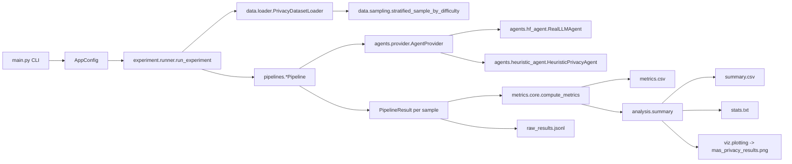

# Empirical Multi-Agent Privacy Evaluation (Production Project)

This repo is a production-style refactor of the original research notebook into modular Python.
It evaluates **multi-agent LLM privacy/PII detection** under different coordination topologies,
quantifying both:

- **Quality**: F1 / precision / recall / accuracy (plus FPR/FNR)
- **Overhead**: end-to-end latency, token usage, context growth
- **Coordination dynamics**: disagreement and escalation
- **Reliability**: JSON parse failures / retries (agents must output strict JSON)

The default backend is a **local Hugging Face chat model** (example: `Qwen/Qwen2-0.5B-Instruct`).

If you want the original end-to-end notebook, see `../MAS_Privacy_Empirical_Framework_(1).ipynb`.

---

## Why This Project Exists

Multi-agent systems (MAS) are often justified as improving accuracy by combining multiple “views” of a problem.
In privacy/PII detection, that accuracy gain comes with real costs:

- More agents ⇒ more inference calls ⇒ higher latency and token cost
- More coordination ⇒ higher disagreement and sometimes worse outcomes (“coordination collapse”)
- Structured outputs (JSON) can fail in real LLMs ⇒ must be measured as a reliability metric

This repo makes those trade-offs measurable and reproducible.

---

## End-to-End Flow (What Happens When You Run It)

At a high level, the experiment runner performs a sweep over:

- **Topology**: sequential / parallel / hierarchical / blackboard
- **Agent count**: `N` agents per pipeline
- **Trials**: repeated runs with different seeds

For each configuration, it:

1) Builds a dataset of privacy samples (curated + optional HF dataset)
2) Stratified-samples a small evaluation slice per trial (by difficulty)
3) Runs the chosen MAS topology on each sample
4) Aggregates per-sample `PipelineResult`s into a per-configuration `ExperimentMetrics`
5) Writes artifacts (CSV/JSONL/PNG/TXT) to `outputs/`

---

## System Architecture



### Code Map (Where Things Live)

- **Entry point / CLI**: `main.py`
- **Config dataclasses**: `src/mas_privacy_eval/config.py`
- **Dataset**: `src/mas_privacy_eval/data/`
	- Curated corpus: `curated_corpus.py`
	- Loader: `loader.py`
	- Stratified sampling: `sampling.py`
- **Agent backends**: `src/mas_privacy_eval/agents/`
	- HF-backed agent + strict JSON parsing: `hf_agent.py`
	- Heuristic dry-run backend: `heuristic_agent.py`
	- Agent factory abstraction: `provider.py`
	- Role prompts + JSON schemas: `prompts.py`
- **Coordination topologies**: `src/mas_privacy_eval/pipelines/`
- **Metrics + bootstrap CI**: `src/mas_privacy_eval/metrics/core.py`
- **Aggregation + statistics**: `src/mas_privacy_eval/analysis/summary.py`
- **Plotting to PNG**: `src/mas_privacy_eval/viz/plotting.py`

---

## Coordination Topologies (What “N agents” Means)

All topologies produce a `PipelineResult` per sample (final label + confidence + traces + overhead stats).

### 1) Sequential (Chain-of-Agents)

- Agents run **one after another**.
- Each agent sees the **accumulated context** from previous agents.
- Final decision is a **confidence-weighted vote** over all valid agent labels.

Implementation: `pipelines/sequential.py`

### 2) Parallel + Consensus

- If `N > 1`: run `N-1` worker agents independently, then run **one Consensus** agent to aggregate.
- If `N == 1`: run **exactly one worker** and **no Consensus** (so the sweep parameter is consistent).
- Final decision comes from Consensus when available, otherwise majority/mean vote over workers.

Implementation: `pipelines/parallel.py`

### 3) Hierarchical (Supervisor-Directed)

- Creates a variable number of Detect/Analyze/Validate agents based on `N`.
- The system builds context progressively and may end with a Consensus step.
- Final decision is a confidence-weighted vote across the hierarchy.

Implementation: `pipelines/hierarchical.py`

### 4) Blackboard (Shared Memory)

- Agents read/write to a **shared blackboard state**.
- The blackboard maintains an evolving probability of `label=1` based on agent updates.
- Final decision is computed from the blackboard probability.

Implementation: `pipelines/blackboard.py`

---

## Agent Roles + JSON Contract (Critical)

Agents are role-specialized (Detector, Analyzer, Validator, Consensus).
Each role is instructed to return **ONLY a JSON object** with a fixed schema.

Why this matters:

- Real LLMs sometimes output extra text, code fences, or invalid JSON.
- This system treats parse failure rate as a first-class reliability metric.

See `agents/prompts.py` for the exact schemas. At minimum every agent output must include:

```json
{
	"label": 0,
	"confidence": 0.0,
	"reasoning": "..."
}
```

The HF-backed agent attempts parsing, and on failure it retries with a stricter instruction.
Retries and failures propagate into the pipeline and metrics.

---

## Dataset

The dataset is intentionally small and auditable by default:

- **Curated corpus** with labeled examples across:
	- `category`: `pii`, `prompt_injection`, `contextual`, `clean`
	- `difficulty`: `easy`, `medium`, `hard`
- **Optional HF dataset** (`ai4privacy/pii-masking-200k`) is supported best-effort (streaming)

Sampling per trial is approximately stratified by difficulty.
Defaults live in `DatasetConfig` in `src/mas_privacy_eval/config.py`.

---

## Metrics (What Gets Measured)

Per-configuration (topology × N × trial) metrics are computed from per-sample `PipelineResult`s:

### Performance
- F1, precision, recall, accuracy
- FPR and FNR (from confusion matrix)

### Systems / Overhead
- Mean latency (ms/sample), p50/p95 latency
- Mean token usage (and in/out token split)
- Mean context size (characters)

### Coordination + Reliability
- Disagreement rate (fraction of samples with conflicting agent labels)
- Escalation rate (when Consensus sets `"escalate": true`)
- JSON parse failure rate + retry rate

---

## Quickstart

1) Create and activate a virtual environment.

2) Install dependencies:

```bash
pip install -r requirements.txt
```

3) Run a tiny sweep to verify wiring end-to-end:

```bash
python main.py --dry-run
```

Dry-run uses a lightweight heuristic agent backend (no model download) to validate:

- dataset creation
- topology wiring
- metric aggregation
- artifact generation

4) Run a real model sweep:

```bash
python main.py
```

5) Launch the Streamlit UI:

```bash
streamlit run streamlit_app.py
```

If you hit a PyTorch/Streamlit watcher crash on Windows, run:

```bash
set STREAMLIT_SERVER_FILE_WATCHER_TYPE=none
streamlit run streamlit_app.py
```

The UI lets you:

- choose the topology and agent count
- use the curated corpus or upload your own CSV/JSONL dataset
- run the selected pipeline
- inspect per-sample outputs, aggregated metrics, and analysis text

For uploads, the dataset should include at least a `text` column. Optional columns:

- `label` or `true_label`
- `difficulty`
- `category`
- `source`

### Useful CLI Options

```bash
# Choose topologies (comma-separated)
python main.py --topologies sequential,parallel,hierarchical,blackboard

# Choose agent counts (comma-separated)
python main.py --agent-counts 1,2,3,4

# Control sweep size
python main.py --trials 3 --samples 20

# Use deterministic decoding (reduces randomness, not guaranteed fully deterministic on GPU)
python main.py --no-sampling

# Turn off plots/stats if you only want raw metrics
python main.py --skip-plots --skip-stats
```

---

## Outputs (Artifacts + How to Read Them)

Artifacts are written under `outputs/` (change via `--output-dir`).

### 1) `raw_results.jsonl`

One JSON object per evaluated sample with fields like:

- `topology`, `n_agents`, `trial`, `seed`
- `sample_id`, `true_label`, `pred`, `confidence`
- `latency_ms`, `tokens`
- `disagreement`, `escalated`
- `parse_failures`, `parse_retries`
- `difficulty`, `category`

Use this file for deeper debugging (which samples fail, where disagreement comes from, etc.).

### 2) `metrics.csv`

One row per (topology, N, trial). This is the core quantitative dataset.

### 3) `summary.csv`

Aggregated mean/std by (topology, N) across trials.

### 4) `stats.txt`

A compact report that mirrors the notebook’s “research write-up” style:

- best N per topology by an efficiency heuristic
- Mann–Whitney tests across topologies (F1)
- Spearman correlation for N vs F1 per topology
- latency scaling analysis (linear vs quadratic fit)

### 5) `mas_privacy_results.png`

Saved plot (no notebook rendering) showing:

- F1 vs N (with bootstrap CI shading)
- Latency vs N (with bootstrap CI shading)
- Tokens vs N
- Disagreement vs N

---

## Results (From the Original Notebook Run)

The notebook includes a stored “real inference” run (as saved inside the `.ipynb`).
These results are included here to make the project end-to-end and to show the kind of analysis
the pipeline produces.

Important caveats:

- The notebook run used a specific backend/model (the figure title references **Claude Haiku**).
- This production refactor defaults to a **local HF model**, so absolute numbers will differ.
- Treat these as a reference example, not a guarantee of performance.

### Key Findings (Notebook)

- **Best efficiency N\*** (F1 per latency):
	- `sequential`: N\*=1, F1=0.781, latency≈2914ms
	- `parallel`: N\*=4, F1=0.679, latency≈16958ms
- **Topology difference was significant** (Kruskal–Wallis H-test): H=5.436, p=0.0197
- **Best topology depends on N** (mean F1): sequential wins for N=1–3,5–6; parallel wins at N=4

<details>
<summary><b>Notebook: Comprehensive Results Table (mean ± std + CI)</b></summary>

```
	topology    n_agents  F1_mean  F1_std      95%_CI_F1   Prec_mean  Rec_mean   Lat_mean    Tok_mean  Disag_rate  Parse_fail
	parallel           1    0.664   0.095  [0.556, 0.772]      0.691     0.641   8900.401   1126.833      0.317       0.050
	parallel           2    0.516   0.291  [0.187, 0.846]      0.589     0.462   9825.014   1122.683      0.300       0.017
	parallel           3    0.389   0.052  [0.331, 0.448]      0.557     0.308  14125.222   1698.483      0.633       0.050
	parallel           4    0.679   0.066  [0.605, 0.753]      0.675     0.692  16957.925   2038.900      0.700       0.050
	parallel           5    0.554   0.150  [0.384, 0.723]      0.611     0.513  20829.862   2697.033      0.817       0.117
	parallel           6    0.441   0.088  [0.342, 0.541]      0.519     0.385  24205.460   3334.350      0.917       0.133
	sequential         1    0.781   0.101  [0.667, 0.895]      0.796     0.795   2914.074    367.983      0.000       0.000
	sequential         2    0.723   0.159  [0.543, 0.903]      0.691     0.769   6725.813    941.233      0.333       0.000
	sequential         3    0.665   0.025  [0.637, 0.694]      0.645     0.692   9871.288   1369.950      0.583       0.000
	sequential         4    0.568   0.107  [0.447, 0.689]      0.612     0.538  17145.084   2371.733      0.750       0.117
	sequential         5    0.691   0.080  [0.600, 0.782]      0.756     0.641  20138.208   2922.867      0.800       0.150
	sequential         6    0.587   0.076  [0.501, 0.673]      0.592     0.590  25869.994   3815.467      0.783       0.133
```

</details>

<details>
<summary><b>Notebook: Significance + Scaling (stdout excerpt)</b></summary>

```
Topology comparison (F1 scores, Kruskal-Wallis H-test):
	sequential    : n=18, mean=0.669, std=0.110
	parallel      : n=18, mean=0.541, std=0.161

	H=5.436, p=0.0197  (significant)

Pairwise topology comparisons (Mann-Whitney U):
	sequential vs parallel : U=236, p=0.0206

Spearman correlation: N_agents vs F1 per topology:
	sequential : ρ=-0.481, p=0.0431
	parallel   : ρ=-0.229, p=0.3597

Latency scaling analysis:
	parallel   : best fit=linear (lin R²=0.984, quad R²=0.991)
	sequential : best fit=linear (lin R²=0.987, quad R²=0.990)
```

</details>

---
