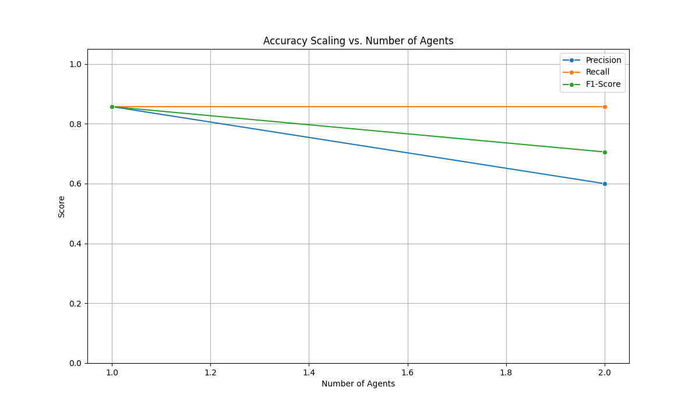

# PrivMAS Performance & Accuracy Analysis

## Overall Performance Summary
This table shows average performance metrics for each agent count.

|   num_agents |   e2e_ms |   t_inf_ms |   delta_sync_ms |   c_tax_ms |
|-------------:|---------:|-----------:|----------------:|-----------:|
|            1 |  1046.63 |    1044.10 |            0.00 |       2.54 |
|            2 |  1163.19 |    1159.70 |           22.31 |       3.49 |

## Overall Accuracy Summary
This table shows average accuracy metrics for each agent count.

|   num_agents |   precision |   recall |   f1_score |
|-------------:|------------:|---------:|-----------:|
|            1 |        0.86 |     0.86 |       0.86 |
|            2 |        0.60 |     0.86 |       0.71 |

## Leakage Summary
Leakage is reported separately for strict and overlap matching.

|   num_agents |   strict_leakage_rate |   overlap_leakage_rate |   leakage_rate |
|-------------:|----------------------:|-----------------------:|---------------:|
|            1 |                  0.75 |                   0.12 |           0.12 |
|            2 |                  0.88 |                   0.12 |           0.12 |

### Key Metrics Explained
- **e2e_ms**: End-to-end latency.
- **t_inf_ms**: Critical Path (slowest agent).
- **delta_sync_ms**: Synchronization Delay.
- **c_tax_ms**: Coordination Tax (`e2e_ms - t_inf_ms`).

- **strict_leakage_rate**: Fraction of ground-truth PII missed under strict matching.
- **overlap_leakage_rate**: Fraction of ground-truth PII missed under overlap matching.

## System Scaling
How performance changes as we add agents.

## Accuracy Scaling
How accuracy changes as we add agents.

## Per-Label Accuracy Analysis
Average precision, recall, and F1-score for each PII label, grouped by the number of agents.

## Agent Latency & Strategy Analysis
The plots below show the latency distribution for each strategy and the mix of strategies assigned.

