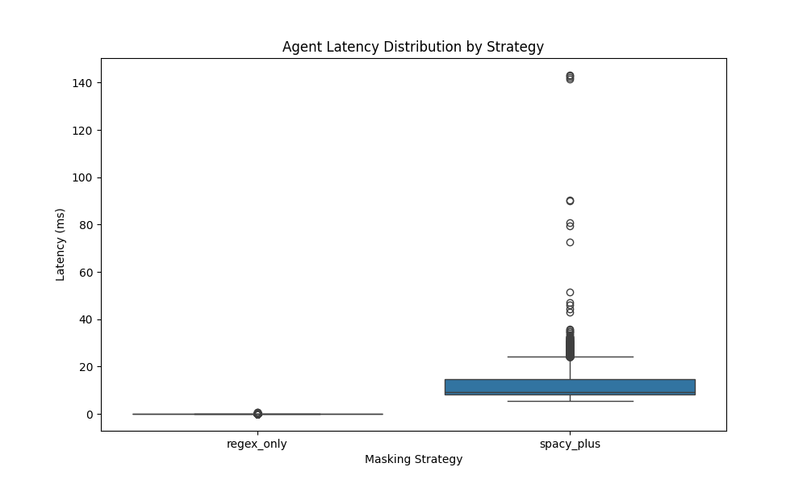
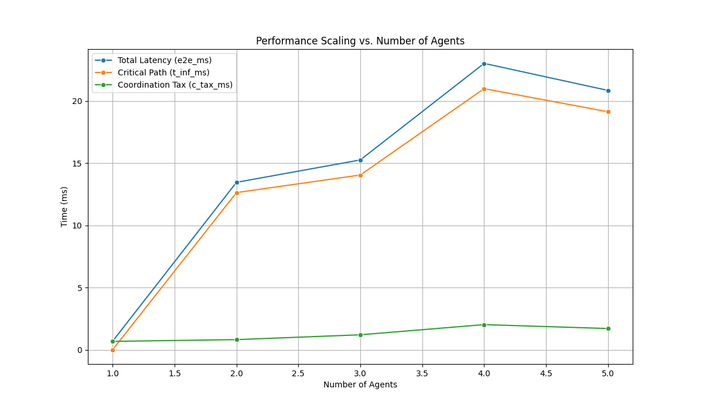
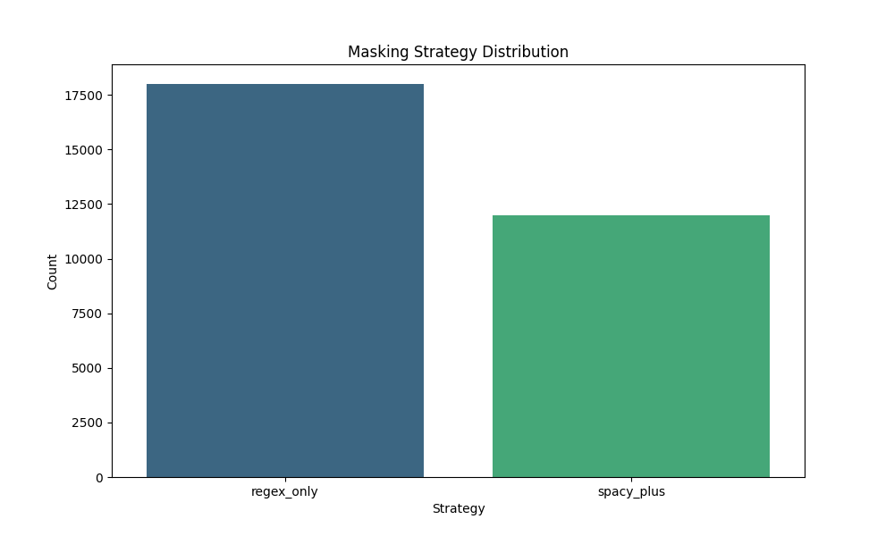

# PrivMAS Performance Analysis

## Overall Performance Summary
This table shows the average performance metrics across all runs for each agent count.

|   num_agents |    e2e_ms |   t_inf_ms |   delta_sync_ms |   c_tax_ms |
|-------------:|----------:|-----------:|----------------:|-----------:|
|            1 |  0.696183 |  0.0140079 |          0      |   0.682175 |
|            2 | 13.4625   | 12.6389    |         12.7141 |   0.823613 |
|            3 | 15.2611   | 14.0494    |         14.1729 |   1.21162  |
|            4 | 23.0192   | 20.9902    |         22.0909 |   2.02892  |
|            5 | 20.8486   | 19.1339    |         20.0141 |   1.71473  |

## Key Metrics Explained
- **e2e_ms**: End-to-end latency. The total time from start to finish.
- **t_inf_ms (Critical Path)**: The latency of the slowest agent. This is the theoretical minimum time for the parallel portion.
- **delta_sync_ms (Synchronization Delay)**: The time difference between the first and last agent completing their work.
- **c_tax_ms (Coordination Tax)**: The overhead from threading, data sharding, and result aggregation (`e2e_ms - t_inf_ms`).

## Agent Latency Analysis
The box plot below shows the latency distribution for each agent strategy. This helps to understand the performance characteristics of each masking approach.

## System Scaling
This plot shows how performance metrics change as we increase the number of agents. Ideally, `e2e_ms` should decrease, but `c_tax_ms` may increase due to higher coordination needs.

## Strategy Distribution
This chart shows the mix of strategies assigned across different agent counts.

